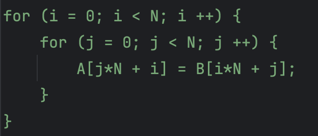
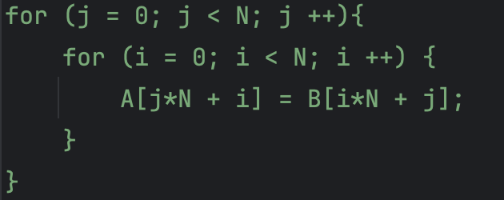
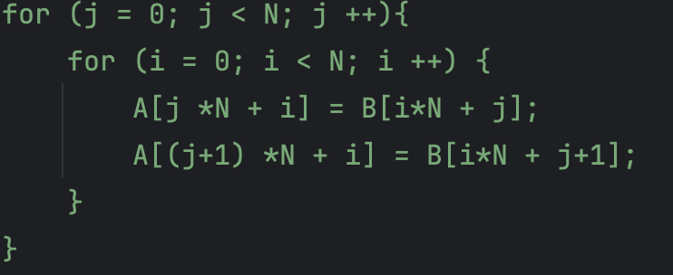
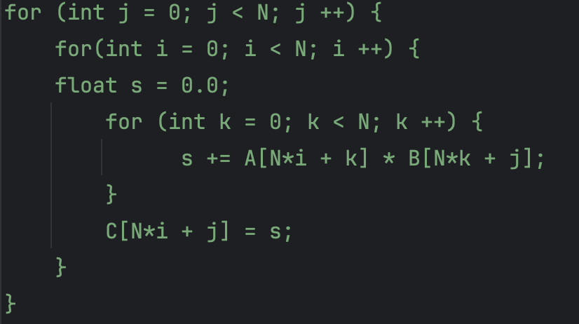
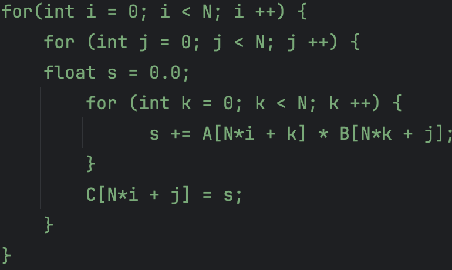
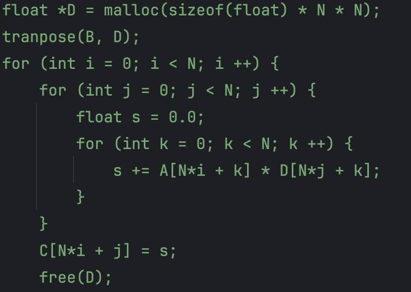
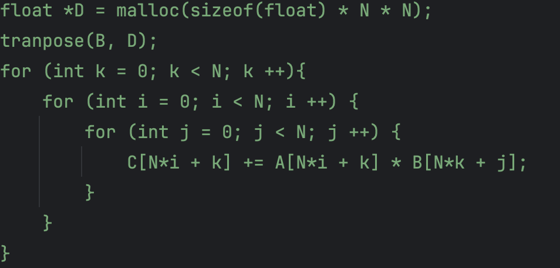

The learning notes of ANU COMP6464 High Performance Scientific Computation.
For learning(beginners), recapping, exams preparation.

<!--more-->

#### Outline
1. Week 1 - Course Introduction and Von Neumann Architecture Measuring Performance
2. Week 2 - Computing with Real Numbers
3. Week 3 - CPU and Memory Architecture
4. Week 4 - Mid-Semester Test
5. Week 5 - Scalar Profiling and Compiler Optimisations
6. Week 6 - Data Access Optimisations

### Week 6
This week’s lecture mainly talks about data access optimizations. Two examples, the matrix transpose and matrix multiply
are given to show how to optimize data access.

#### Matrix Transpose
The operations to generally optimize matrix transpose:
- Flipping
- Loop Unrolling and Jam
- Blocking Algorithms

Comparing the following two Matrix Transpose version;

Version 1:

Version 2:

In version 1, Reads are stride 1, and Writes are stride N.
When we analyse the overall performance of these code, N and Cache Write policy should be taken into account.
For a small N, we don't need to consider the cache read miss and write miss. But for a large N, analysing the cache status is quite important.

Since writes miss is more expensive than reads miss both in write-through or write-back policy, flipping  may improve the performance. 
The overall performance of version 2 better than version 1, as the Reads are stride N, and Writes are stride 1.

Version 3: Loop Unrolling + Flipping

Less cache misses per iteration by loop unrolling.

Version 4: Blocking Algorithm of Matrix Transpose.
Separating the matrix into several blocks, then do matrix transpose in each block.
Why? Try to better use L1/L2 cache, aim to maximize the cache use efficiency.

#### Matrix Multiply
The slide introduces three methods to improve the performance.
- Transpose
- Flipping
- Blocking

The original code for Matrix Multiply is :

The time complexity of the original method is O(N^3).
The cache miss situation for this code is:
1. Reads from A with stride 1
2. Reads from B with stride N
3. Writes to C with stride N

Then we may do outer loop flipping:

The cache miss situation for this code is:
1. Reads from A with stride 1
2. Reads from B with stride N
3. Writes to C with stride 1

Though make outer loop flipping, we may find the GFlops essentially the same. Because both these two code always need to
 use L2 cache. L1 cache is not enough.

Next, transpose matrix B:

After generate Matrix D by transposing Matrix B, we could make the inner loop with:
1. Reads from A with stride 1
2. Reads from D with stride 1
3. Writes to C with stride 1
The time complexity of Transpose Matrix B is O(N^2).

Next, try to make further optimization. We can flip the k loop.

1. Reads from A constant
2. Reads from D with stride 1
3. Writes to C with stride 1

This flipping k loop operation could result in significant improvement in GFlops.

Last but not the least, blocking algorithm is one of optimization methods. However, we need to pay attention to the balance 
between block size and cache miss rate. From the experience results, block size of 8 gives the better performance.

#### Summary
Once we want to do data access optimization, think about the following methods:
1. Flipping
2. Loop unrolling and jam
3. Make blocked version
4. (Try) Efficient implementation using AVX instructions

Remember, the cache write miss is more expensive than cache read miss. 
The fewer cache misses, the better the code. The less memory access, the better the code.

(Continuous updates ... )

<body data-article-id="post-comp6464-HPC-notes">
</body>

    <button id="like-button" onclick="incrementLike()">👍 Like</button>
    Loading...

