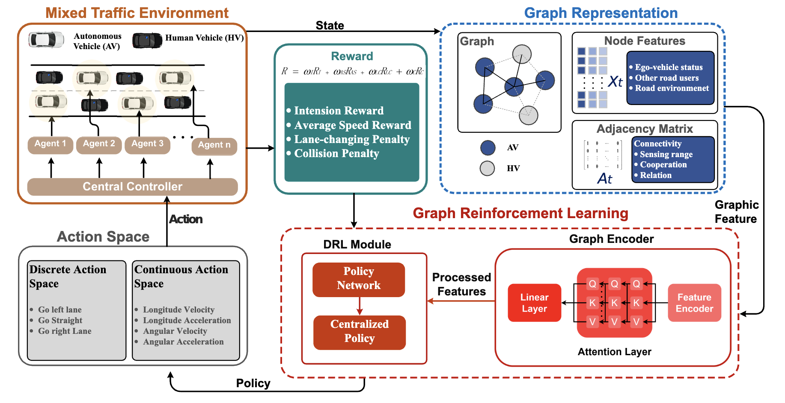

## Introduction

In the field of Intelligent Transportation Systems
(ITS), Connected and Automated Vehicles (CAVs) are viewed
as a crucial component. By utilizing information communication
and cooperative operation, CAVs have the potential to enhance
road safety and improve traffic efficiency. As the transportation
industry shifts from human-operated vehicles (HVs) to large-
scale automated vehicles (AVs), it is important to study the
interactions and cooperation between CAVs and HVs in mixed-
traffic environments. Previous research has utilized machine
learning technology, specifically deep reinforcement learning
(DRL) models, to model mixed autonomy CAVs and decide their
behaviors. However, there is a limited number of studies that
jointly address the cooperation and interactions between AVs
and HVs. This research presents a novel attention-enhanced
graphic reinforcement learning approach for safe, efficient, and
cooperative lane change decision-making in mixed autonomy
CAVs. This approach models interactions with a graph neural
network (GNN) and incorporates the graph representation into
DRL. The graph structure represents the connectivity between
AVs and the attention mechanism in the GNN highlights the
intensity of influence between vehicles. The proposed approach
is verified through a highway ramp simulation scenario created
in SUMO. The results of the experiment show that the proposed
approach significantly improves CAV performance in terms of
safety, efficiency, and cooperation 

The schematic diagram of proposed framework.

